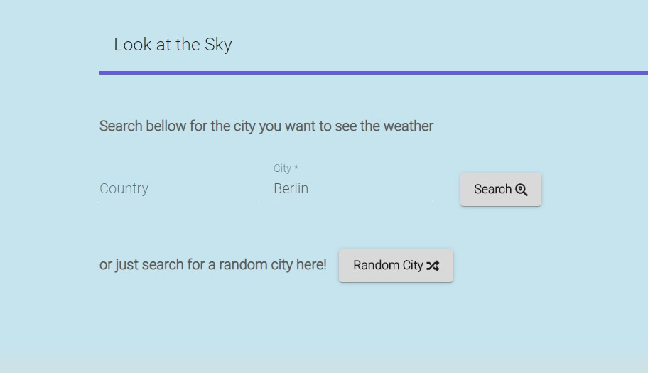
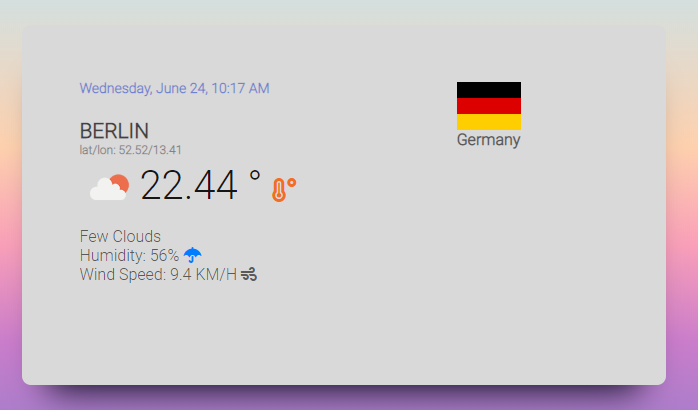
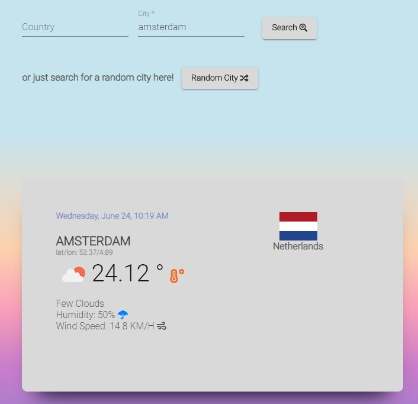

# Look at the Sky

## Description

The purpose of this project is to have a Weathermap api client

## Features

- Weather information for random city
- Circular search until finds a valid city
- Search by Country/City
- Cache strategy for previous searches

## Tech Stack

- Angular 9
- Angular Material
- Font Awesome
- Moment
- [Open Weather Map API](http://openweathermap.org/API#weather)
- [Flag icon CSS](https://github.com/lipis/flag-icon-css)

## Setting up the project

- You'll need node installed. You can find it on [Nodejs](https://nodejs.org/)
- Using your terminal of choice, from the project source folder run the command:

```sh
$ npm install
```

This command should install project dependencies and also the `angular-cli`

## Development server

Run `ng serve` for a dev server. Navigate to `http://localhost:4200/`. The app will automatically reload if you change any of the source files.

## Automatic Documentation

Run `npm run compodoc` to create or renew the documentation. It also opens an http-server via compodoc itself, which will be available under `http://localhost:8080/`.

## Build

Run `ng build` to build the project. The build artifacts will be stored in the `dist/` directory. Use the `--prod` flag for a production build.

## Running unit tests

Run `ng test` to execute the unit tests via [Karma](https://karma-runner.github.io).

Opitionaly you can run `ng test --code-coverage` in order to generate visual information about code coverage.

## Running end-to-end tests

Run `ng e2e` to execute the end-to-end tests via [Protractor](http://www.protractortest.org/).

## TODO list

- Use angular's form validator
- Better validate Country/City inputs
- Improve responsiveness and overall layout
- More e2e tests
- More validation against Open Weather API (Integration tests)
- Add more weather options (E.g next hours, next days)
- improve documentation (Compodoc)

## Screenshots




